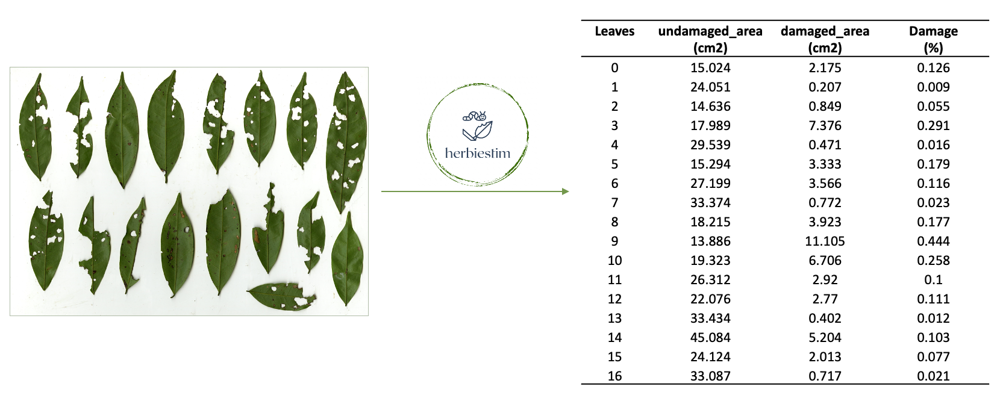
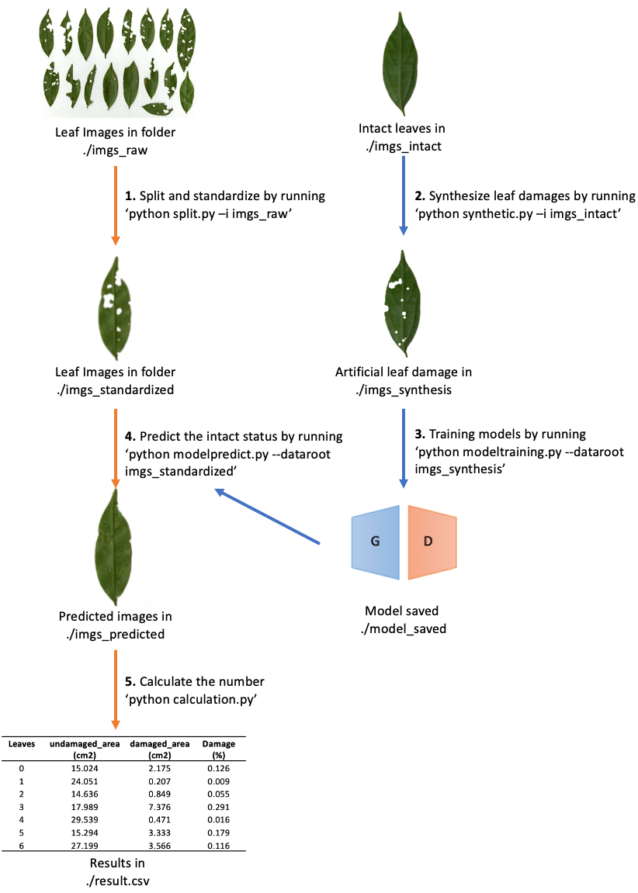

#  HerbiEstim 

  *HerbiEstim* is a Python implementation of a deep learning- and image processing-based method for automatic estimation of leaf herbivore damage. This method takes scanned or photographed leaf images as input and provides estimates of area and percentage of leaf damage. The package consists of a set of functions and step-by-step guidance for applying the method.
  
  


### Overview 
  The application of this method includes several steps: standardizing leaf images, synthesizing training data, training deep learning models, reconstructing damaged leaves, and measuring the area of damaged and undamaged regions. Users have the option to either train their own models using the provided codes or utilize pre-trained models for predicting the area and percentage of leaf herbivore damage.  
  
  The method employs [pix2pix](https://doi.org/10.48550/arXiv.1611.07004), a conditional generative adversarial network (cGAN) designed for image-to-image translation, to reconstruct intact images of damaged leaves. The implementation of pix2pix was developed by [Jun-Yan Zhu et al.](https://github.com/junyanz/pytorch-CycleGAN-and-pix2pix).  
  
  The following figure illustrates the underlying logic of the method and the structure of codes and files in this repository, in order to help users better understand and adapt our approach.  
<p align="center">
  
</p>

### Prerequisites  

* Linux or macOS  

* Conda (Latest version)

* Python 3

### Installation  

* Clone this repo:  

```console 
git clone https://github.com/ZihuiWang1/HerbiEstim
cd HerbiEstim
```

* Install requirements:  

```console 
conda create -n "herbiestim" python=3.8.13
conda activate herbiestim
pip install -r requirements.txt
```  

### Train and use your own models  

Below are the step-by-step instructions to guide users in building their own pix2pix model for leaf damage reconstruction and prediction. Before starting, ensure that intact (healthy) leaf images are prepared for generating the training data. Please note that training pix2pix models can be computationally intensive, so it is highly recommended to use an NVIDIA GPU with CUDA CuDNN. Alternatively, users can utilize pre-trained models, which are explained in the following section.  


1. Standardize leaf images
  * This step takes multiple-leaf images as input, extracts leaves to separate images and returns standardized single-leaf images. 
  * For single images, only resizing will be performed, ensuring uniformity in the dataset.
  
```console 
# input folder required, set output directory by -o argument (Default imgs_standardized).
python split.py -i imgs_raw
``` 

2. Generate Training Data

  * This step automatically generates training data by taking intact leaf images and simulating artificial damages on them. 
  * Users need to provide standardized single-leaf images of intact leaves. In each simulation, the program will randomly select an intact leaf and synthesize leaf herbivore damages using polygons and circles.  
  
```console 
# set -n for the number of simulations (default is 5000). set -o for output directory
python synthetic.py -i imgs_intact -n 5000 -o imgs_synthesis
``` 

3. Train models
  * The function will launch the pix2pix program to train the model based on the synthesized data.
  * Detailed arguments for this function can be found [here](https://github.com/junyanz/pytorch-CycleGAN-and-pix2pix)
   
```console 
# set --gpu_ids 0 for GPU platform (the default is CPU). 
python modeltraining.py --dataroot imgs_synthesis
``` 

4. Reconstruct leaf damage
  * This step takes standardized leaf images as input and predicts the corresponding intact leaves.
  
```console 
# input the files produced in the last step, default output directory is imgs_predicted
python modelpredict.py --dataroot imgs_standardized
``` 

5. Calculation. 
  * This will measure the leaf area of the reconstructed and damaged leaves and calculate the percentage of leaf damage.
  * For scanned leaves with available resolution information (e.g., dpi), the leaf area will be measured in square centimeters (cm²).
  * For images without resolution information, the number of leaf-belonging pixels will be returned.
```console 
# input stanardized images and return measures of leaf area in 'result.csv' 
# Set the resolution of images by --dpi (default is 300). If resolution is not availble, include --notscanned arguement.
python calculation.py
``` 

### Use pre-trained models  

For users who prefer a quicker and less computationally intensive solution, we offer pre-trained models for leaf damage reconstruction. These models have been trained on intact leaves of various plant species and designed for universal application. You can find detailed information about the model training in the associated paper (to update). Additionally, we offer use online version of this function at [http://herbiestim.online/](http://herbiestim.online/)

1. Download pre-trained models

```console 
gdown 16diPwPPT1C7Byquq5WWRfgY3i0rOFI4h -O model_saved/universal/latest_net_G.pth
``` 

2. Standardize leaf images  
```console 
# Default output folder is ./imgs_standardized, set by -o argument.
python split.py -i imgs_raw
``` 
3. Reconstruct leaf damage using universal model
```console 
# input the files produced in the last step, set --name to universal model
python modelpredict.py --dataroot imgs_standardized --name universal
``` 
4. Calculation  
```console 
# set -n to universal model
python calculation.py -n universal
``` 

